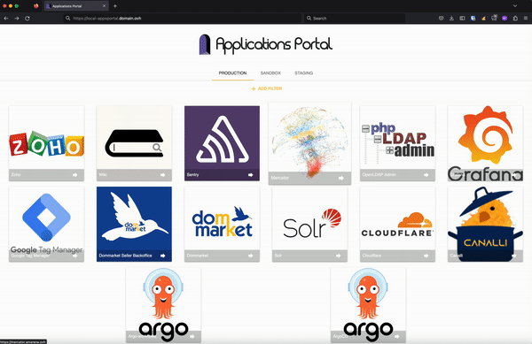
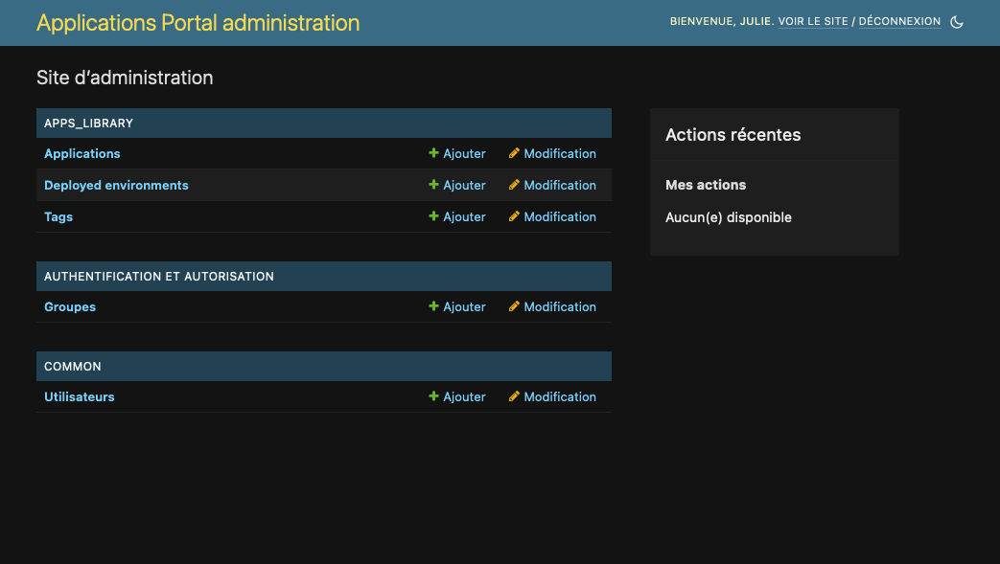

# Apps Portal
Simple Django app to provide an application portal.
Apps are split by environment and tags filters can be applied.
Stop having all your team manage their own browser bookmark and centralise every links in a single tool instead!

Uses [Material Design Lite](https://getmdl.io/) for style
and [HTMX](https://htmx.org/) for easy dynamic page content



Administration is done via classic Django admin.
LDAP and Django user authentication are both configured.

- `Tags` are used as simple filter to search for an app with that same tag associated.
- `Deployed environments` are the environment where some apps are running (production, staging, ...).
- `Applications` should be filled with all the apps you want to provide an easy access to.
  It is defined by a name and icon used for the display, filter tags and one URL for each environment this apps is accessible at.



## Prerequisites
### task
```bash
brew install go-task/tap/go-task
```
### project dependencies
```bash
task install-dependencies
```
## How to run
```shell
cd buildrun/docker/docker-compose/dev-env
# init the app with users and data and run it
# This should be called only the first time you run the app or each time you want to reset the project
task init-app
# Run the app after first initialisation
task up
```


### Network configuration
Ports [80, 443, 9090, 5432] must be available on your machine.

#### DNS
On a mac, add the following rule to `/etc/hosts`:
```
127.0.0.1	local-appsportal.domain.ovh
```

#### Certificate
To be able to correctly run your website in HTTPS without your browser protesting about an invalid
certificate, you'll need to manually add and trust the Caddy root certificate
located [here](buildrun/docker/caddy/.caddy/data/caddy/pki/authorities/local/root.crt).
On a Mac, simply open this file using Keychain Access, then double-click on the certificate
once it has been added to *System* keychain, and in the Trust settings select "Always Trust".
If your browser still display the certificate as invalid after that, restart your browser.

#### Urls
Don't use `localhost` as you'll have errors with the HTTPS configuration.
- apps_portal website: https://local-appsportal.domain.ovh/ (if you get a warning about invalid certificate, see previous section)
- LDAP Admin: http://local-appsportal.domain.ovh:9090/ (login DN is "cn=readonly,dc=domain,dc=ovh", pwd in `AUTH_LDAP_BIND_PASSWORD` of [dev.env](buildrun/docker/apps_portal/dev.env))

### Authentication

The LDAP is populated via [LDIF file](buildrun/docker/ldap/custom/00_export.ldif).
All users have the password "azertyuiop"
You can connect using the admin user created automatically on initialisation (username admin, for password see [DJANGO_SUPERUSER_PASSWORD](buildrun/docker/apps_portal/dev.env))
or one of the existing ldap user in admins group.

## How to add a new Python package requirement

Add you requirement to [base-requirements.in](buildrun/docker/apps_portal/requirements/base-requirements.in)
(or dev-* / prod-* / test-* if your package is only useful in one specific context).
Then run:
```shell
cd buildrun/docker/docker-compose/dev-env
task compile-dep
# Don't forget to rebuild the service to include the new dependency
docker-compose up -d --no-recreate --build web
```
**/!\ The compile-dep service will also upgrade all existing packages;
remove all `--upgrade` option in the [docker-compose](buildrun/docker/docker-compose/dev-env/docker-compose.yml) command of compile-dep service to avoid that**.
